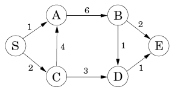

实验四

实验目的与要求：掌握动态规划方法的基本思想与设计策略。

1．多段图中的最短路径问题
【问题描述】
建立一个从源点S到终点T的多段图，设计一个动态规划算法求出从S到T的最短路径值，并输出相应的最短路径。

设d(i)表示源点s(0)到点i的最短路径值,用二维数组w[][]来记录图

base case: 
    d(0)=0;
    
DP方程:

若要打印最短路径，需要增加一维表prev[]记录前驱节点
~~~
//base case
d[0] = 0;
for (int i = 1; i < n; i++)
    d[i] = INFINITY;
//for
for (int i = 1; i < n; i++) {
    int temp = d[i];
    for (int j = 0; j < i; j++) {
        if (w[j][i] != 0)
        {
            temp = d[j] + w[j][i];
            if (temp < d[i])
            {
                d[i] = temp;       
                prev[i]=j;
            }
        }
    }
}
~~~
> 若要到打印最短路径，用path[]记录最短路径，并打印。

2．有向无环图中的最短路径问题
【问题描述】
建立一个从源点S到终点E的有向无环图，设计一个动态规划算法求出从S到E的最短路径值，并输出相应的最短路径。

